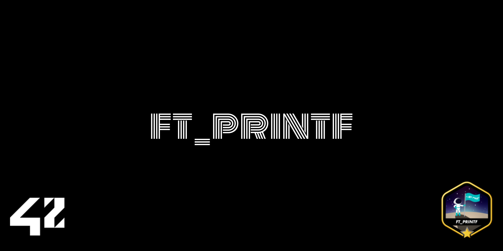
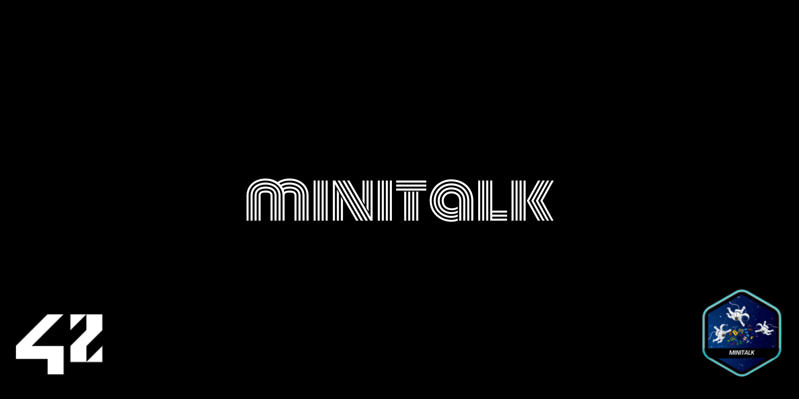

# 42-project-badges
I gather cute little badges for 42 curriculum projects. Besides, I create my own badge if I can't find any. Feel free to star the repo and use them :)

Or feel free to contribute B-)

### ⭐ Badges

| Project       | Badge w Bonus                                             |
|:--------------|:--------------------------------------------------:|
| libft         |                  |
| get_next_line |  |
| ft_printf     |          |
| born2beroot   |      |
| push_swap     |          |
| minitalk      |            |
| philosophers  |    |
| minishell     |          |
| netpractice   |    |
| cub3d         |                  |

  

### 🌠 Cover Pages

| Project       | Cover Pages                                        |
|:--------------|:--------------------------------------------------:|
| libft         |                  |
| get_next_line |  |
| ft_printf     |          |
| born2beroot   |      |
| push_swap     |          |
| minitalk      |            |
| philosophers  |    |
| minishell     |          |
| netpractice   |    |
| cub3d         |                  |
