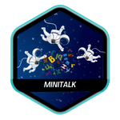
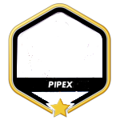
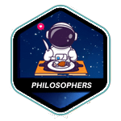
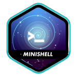
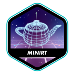
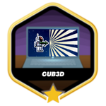

# 42-project-badges
I gather cute little badges for 42 curriculum projects. Besides, I create my own badge if I can't find any. Feel free to star the repo and use them :)

Or feel free to contribute B-) You can contribute with adding missing images either badge or cover.

### ⭐ Badges

| Project       |                    Badge                     |                        With Bonus                        |
| :------------  | :------------------------------------------: | :------------------------------------------------------: |
| libft          |                  |                  |
| get_next_line  |  |  |
| born2beroot    |      |      |
| ft_printf      |          |          |
| minitalk       |                                              |            |
| minitalk alt   |    |                                                          |
| pipex          |            |                  |
| so_long        |                                              |              |
| push_swap      |          |          |
| philosophers   |    |    |
| minishell      |          |          |
| minishell alt  |  |  |
| netpractice    |    |                                                          |
| netpractice alt|                                              |    |
| minirt         |                |                                                          |
| cub3d          |                  |                        |

---

### 🌠 Cover Pages

| Project       |            Cover Pages             |                           With Bonus                           |
| :------------ | :--------------------------------: | :------------------------------------------------------------: |
| libft         |  |                  |
| get_next_line |                                    |  |
| ft_printf     |                                    |          |
| born2beroot   |                                    |      |
| push_swap     |                                    |          |
| so_long       |                                    |              |
| minitalk      |                                    |            |
| philosophers  |                                    |    |
| minishell     |                                    |          |
| netpractice   |                                    |    |
| cub3d         |                                    |                  |
